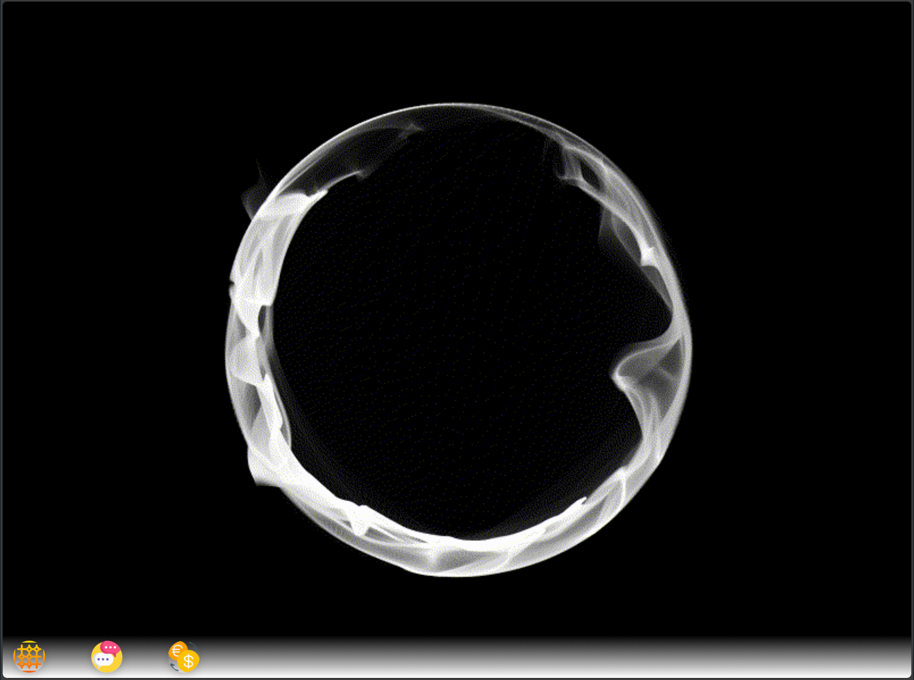

# A3 SPA




# Brief overview of each part

1. index.html: The main HTML document that structures the web application. It includes links to separate CSS files for styling and JavaScript files for functionality. The body contains a container for the desktop and a footer acting as a taskbar with buttons to open different applications.

2. main.js: This script provides core functionalities like making elements draggable and creating new windows on the desktop. It also handles the z-index to manage the stacking order of elements.

3. currencyConverter.js: Contains functions for creating a currency converter application. It fetches currency rates from an API and allows users to convert amounts between different currencies.

4. memoryGame.js: Manages the logic and UI for a memory game. Users can play the game in different grid sizes, and the script handles the game's mechanics like matching cards, counting moves, and timing.

5. openChat.js: Implements a chat application. It connects to a WebSocket for real-time messaging and handles user interactions like sending messages, choosing emojis, and displaying chat history.


# How to run the Personal Web Desktop

1. You have to Clone the Personal Web Desktop to a repo of your choise.
2. When you have done that start by using the following commands:

```
npm isnatll
```

then run this

```
npm run build

```

Finally run the Personal Web Desktop using the following command:

```
npm run serve

```

# how to execute the linters that are part of the development environment and how to execute them.

1. To check that no error in the code use this:

```
npm run lint

```
2. if you want to fix all auto fixable problem use this:


```
npm run stylelint:fix
```